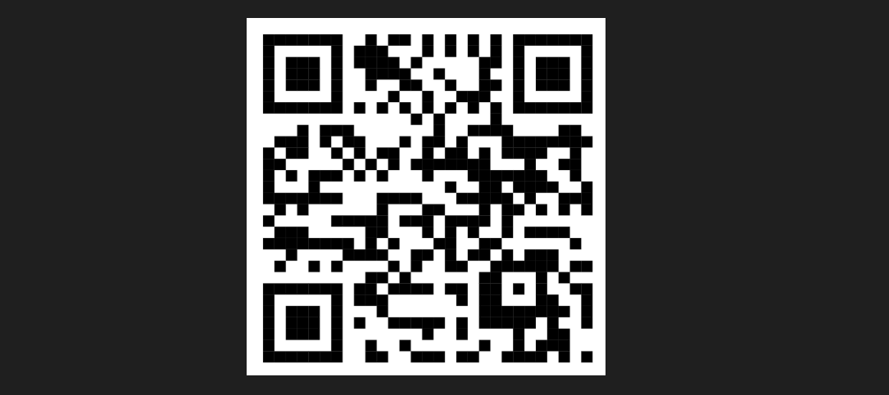

<!-- # Slide 1  -->

# **WELCOME TO OPEN SOURCE CONTRIBUTION WORKSHOP**

###### IEEE DBIT CS Presents

---

# The Tools of the Trade 🛠️

###### Before we start, let's meet the two essential tools:

##### 1. Git

It's a program on your computer that tracks every single change you make. It's the foundation of version control.

##### 2. GitHub

Think of it as a social network for coders.
It's where projects live, where you find code, and where you collaborate with others.

---

# **Today's Mission:** Add your name to the contributors list on a repo and send a PR(pull request to the owner of the repo)

##### **Let's get started...**

---

#### **We will see all of it in detail now one by one**

1. [Fork] --> B[Clone]
2. B --> C[Branch]
3. C --> D[Edit]
4. D --> E[Add]
5. E --> F[Commit]
6. F --> G[Push]
7. G --> H[Pull Request]

---

# 1. FORKING

## What is Forking?

- Creates **your personal copy** of the project on GitHub
- You own this copy - experiment freely!
- The original project stays untouched

---

# 2.CLONE

- Downloads **your fork** to your local machine
- Creates a complete copy with full history
- Sets up the connection between local and remote
- Command for cloning a repo in your local desktop :

###### `git clone url_of_the_repo`

---

# 3. CREATE A BRANCH

- **Safe workspace** for your changes
- **Best practice** in open source
- Keeps your changes organized and isolated
- Command:

###### `git checkout -b add-your-name`

---

# 4. MAKE YOUR EDIT

- Open `Contributors.md` in your text editor
- Add your name to the list
- Follow the existing format

### Pro Tip

###### Always read the project's `CONTRIBUTING.md` first!

---

# 5. CHECK STATUS

- Most imp command
- **Red text**: Files you've modified
- **Green text**: Files ready to be committed
- This is your "situation report"
- Command:

###### `git status`

---

# 6. STAGE YOUR CHANGES

- Puts your changes in the "staging area"
- Think: "putting items in your shopping cart"
- Run `git status` again to see the difference!
- Command:
  `git add contribution.md`

---

# 7. COMMIT

- It should be **Clear and descriptive**
- Explains **what** you changed
- Future you (and others) will thank you
- Command :
  `git commit -m "Add [Your Name] to contributors list"`

---

# 8. PUSH

- Uploads your new branch to **your fork** on GitHub
- Makes your changes visible online
- Prepares for the final step...

Command:
`git push origin add-your-branch-name`

---

# Step 9: Create a Pull Request

## The Magic Moment

- Go to your fork on GitHub
- Click the green **"Compare & pull request"** button
- Fill out the title and description
- Click **"Create pull request"**

---

# **Congratulations!** ✨
#### You've just made your first open source contribution!

    

        <h2>Any Questions? 🤔</h2>
    

    

        <h2>Thank You! 🙏</h2>
    

---
## Some links where you can find projects to contribute
###### Form a team with your friends and start
- https://github.com/MunGell/awesome-for-beginners
- https://goodfirstissue.dev/language
- https://summerofcode.withgoogle.com/programs/2025/organizations
- to read : https://www.reddit.com/answers/386a070a-6f8f-48c1-adc2-71e68286353a/?q=Easy%20open%20source%20projects%20for%20beginners&source=PDP

---
# We Appreciate Your Feedback!
